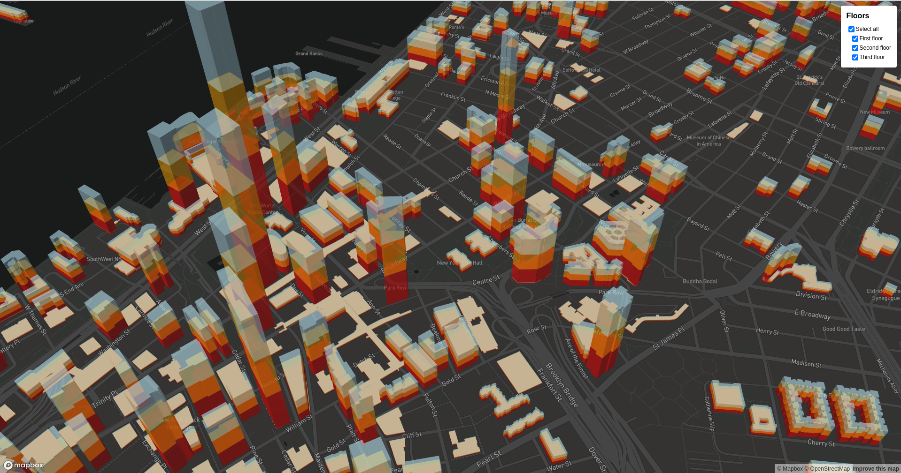

# @adrisolid/mapbox-gl-layers-control

> Mapbox GL JS Layers Control

---

<h4>I need some caffeine to work :)</h4>
<a href='https://ko-fi.com/R6R01NRMJ' target='_blank'></a>

---

### [https://adrisolid.github.io/mapbox-gl-layers-control](Demo)



### Features

- Create a layers control by wrapping Mapbox GL JS layers id's.
- Layers could be grouped. If all layers of a group are `visible` 'select all' checkbox will be checked, otherwise, will be unchecked.
- Visibility is firstly controled under `visibility` layout property, if this property does not exists, Mapbox GL JS assumes that is `visible`.

### Getting Started

```bash
yarn add @adrisolid/mapbox-gl-layers-control
```

### Usage with Vanilla JS:

```js
import { Map } from "mapbox-gl";
import { MapboxLayersControl } from "@adrisolid/mapbox-gl-layers-control";
import "@adrisolid/mapbox-gl-layers-control/styles.css";

const LAYERS_INFO = [
  {
    id: "buildings-1",
    color: "red",
    xtrsnH: ["/", ["get", "height"], 2],
    xtrsB: ["get", "min_height"],
  },
  {
    id: "buildings-2",
    color: "orange",
    xtrsnH: ["get", "height"],
    xtrsB: ["/", ["get", "height"], 2],
  },
  {
    id: "buildings-3",
    color: "lightblue",
    xtrsnH: ["*", ["get", "height"], 1.5],
    xtrsB: ["get", "height"],
  },
];

const map = new Map({
  style: "mapbox://styles/mapbox/dark-v10",
  center: [-74.0066, 40.7135],
  zoom: 15.5,
  pitch: 45,
  bearing: -17.6,
  container: "map",
  antialias: true,
});

function layerGenerator(layers) {
  layers.forEach((layer) => {
    map.addLayer({
      id: layer.id,
      source: "composite",
      "source-layer": "building",
      filter: ["==", "extrude", "true"],
      type: "fill-extrusion",
      minzoom: 15,
      paint: {
        "fill-extrusion-color": layer.color,
        "fill-extrusion-height": layer.xtrsnH,
        "fill-extrusion-base": layer.xtrsB,
        "fill-extrusion-opacity": 0.6,
      },
    });
  });
}

map.on("load", function () {
  layerGenerator(LAYERS_INFO);

  map.addControl(
    new MapboxLayersControl({
      title: "Floors",
      layersDefinition: [
        {
          name: "Select all",
          group: true,
          children: [
            {
              id: "buildings-1",
              name: "First floor",
            },
            {
              id: "buildings-2",
              name: "Second floor",
            },
            {
              id: "buildings-3",
              name: "Third floor",
            },
          ],
        },
      ],
    }),
  );
});
```

### Usage with React

[Check this out :)](https://github.com/AdriSolid/mapbox-gl-layers-control/tree/master/examples/with-react)

### Properties:

- **title** (Default: `""`): `string` Layers control title
- **layersDefinition** (Default: `{}`): `LayersDefinition` Layers control definition. Following these types:

  ```ts
  type LayersInfo = Array<{ id: string; name: string }>;
  type LayersDefinition = Array<{ children: LayersInfo; group?: boolean; name?: string }>;
  ```
